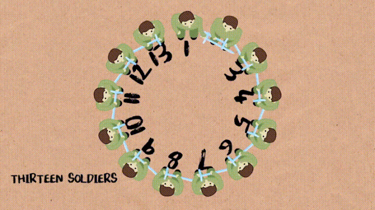

<div align="center">
<h1 align="center">josephus problem</h1>
<br />
<br>
<br>
A solution to the known josephus problem, support any circle size
</div>

***


### Installation
```
gcc josephus.c
```

### Usage
```
You can rewrite the value of function to change the circle size.
```

### License
This project is licensed under the MIT license
### Show your support
Leave a ⭐ if you like this project
